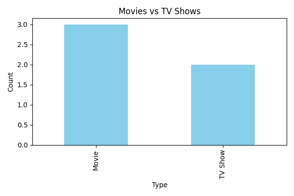

# Netflix Data Analysis 

This is a basic data analysis project using Python, Pandas, and Matplotlib.

## 🔍 What It Does
- Analyzes sample Netflix data
- Compares Movies vs TV Shows
- Generates a bar chart using matplotlib

## 🛠 Tools Used
- Python
- Pandas
- Matplotlib
- VS Code

## ▶️ How to Run
- Open terminal
- Run: `python netflix_analysis.py`

## 📁 File
- `netflix_analysis.py`: Main code

## 📊 Sample Output Chart

